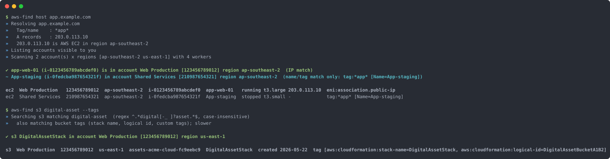

# 🔎 aws-find

Search every account in an AWS Organization for a resource, from the terminal.

A single bash script that asks IAM Identity Center which accounts you can
reach, fans out read-only lookups across all of them in parallel, and hands
back a one-click console deep link into the right account, role and region.
Give it a hostname, a bucket name, a security group, a prefix list or a Lambda
name and it tells you where that thing lives.



> 🤖 **AI agents:** see [AGENTS.md](AGENTS.md) for the setup, the offline test
> harness, the worker contract and the rules for changing this tool.

## Prerequisites

- **[AWS CLI v2](https://docs.aws.amazon.com/cli/latest/userguide/getting-started-install.html)**
  configured for IAM Identity Center (an `[sso-session NAME]` block in
  `~/.aws/config`). Create one with `aws configure sso-session` if you have
  none.
- **[jq](https://jqlang.github.io/jq/)** for JSON handling.
- **[fzf](https://github.com/junegunn/fzf)** *(optional)* — enables the
  interactive picker. Without it the first hit is selected automatically.
- **dig** for `host` searches; ships with macOS and most Linux distributions
  (`bind-utils` / `dnsutils`).
- **bash** ≥ 4 and standard Unix tools (`xargs`, `awk`, `column`).

  ```sh
  # macOS (Homebrew)
  brew install awscli jq fzf
  ```

## Installation

```sh
git clone https://github.com/GavinTomlins/aws-find.git
cd aws-find
chmod +x aws-find
```

Optionally symlink it onto your `PATH`:

```sh
ln -s "$PWD/aws-find" /usr/local/bin/aws-find
```

If `~/.aws/config` holds several `sso-session` blocks, tell aws-find which one
to use from your shell profile (`~/.zshrc` / `~/.bashrc`):

```sh
export AWS_FIND_SSO_SESSION=my-org
```

## Usage

```sh
aws-find host   <dns-name>      # which account/region hosts this hostname?
aws-find s3     <glob>          # S3 buckets whose name matches
aws-find sg     <glob>          # security groups by id, name, description or tag
aws-find pl     <glob>          # managed prefix lists by id, name or tag
aws-find lambda <glob>          # Lambda functions by name
aws-find roles                  # the permission sets you hold in each account
aws-find --help                 # kinds, examples and every flag
```

Globs are case-insensitive and support `*` and `?`. A pattern with no wildcard
is treated as `*pattern*`. Hyphen, underscore and space are optional
separators, so `digital-asset` also matches `DigitalAssetStack`. Quote a bare
`*` so the shell does not expand it.

```sh
aws-find host app.example.com
aws-find host --name payroll app.example.com     # also match tag values *payroll*
aws-find s3 backup                               # any bucket containing "backup"
aws-find s3 'acme-*-logs'                        # anchored glob
aws-find s3 digital-asset --tags                 # also match bucket tags (CDK/CFN stack name, logical id)
aws-find sg 'sg-0a1b*'                           # by group id prefix
aws-find sg payroll --regions "ap-southeast-2"   # by name/description/tag, one region
aws-find sg '*'                                  # every security group in the org
aws-find pl office                               # prefix lists named *office*
aws-find lambda 'billing-*' --accounts pick      # fzf-select which accounts to scan
aws-find lambda thumbnail --json | jq .          # machine-readable, no picker
aws-find sg payroll --show-commands              # learn the CLI: every aws command used, grouped and explained
aws-find roles                                   # which role will be used where?
```

If no SSO token is valid, aws-find runs `aws sso login` for the session and
continues once the browser sign-in completes.

### Command-line options

| Option | Description |
| ------ | ----------- |
| `<kind> <pattern>` | Positional: one of `host`, `s3`, `sg`, `pl`, `lambda`, then a DNS name (`host`) or a glob. `roles` takes no pattern. |
| `--regions "r1 r2"` | Regions scanned in every account. Default `ap-southeast-2 us-east-1`; `host` adds the region Amazon's IP ranges report for the address. |
| `--accounts pick` | fzf multi-select which accounts to scan instead of all of them. |
| `--role NAME` | Permission set to assume in every account. Warns per account when you do not hold it. |
| `--parallel N` | Concurrent account×region workers. Default 8. |
| `--json` | Print result rows as JSON lines to stdout and skip the picker. |
| `--show-commands` | After the scan, print every `aws` CLI command that ran, with the SSO token redacted, identical commands across accounts grouped with a count and region list, and a one-line explanation of what each one is for. Goes to stderr, so it combines with `--json`. See *Learning the CLI*. |
| `--debug` | Print every captured AWS error in full and write an xtrace file (path shown at start). |
| `--tags` | `s3` only: also match bucket tag values and show the CloudFormation stack name as the label. One extra call per bucket. |
| `--name PAT`, `--no-name` | `host` only: tag/name pattern to search alongside the IP (default: first DNS label), or disable it. |
| `--fast` | `host` only: one query against an org-wide Config aggregator instead of the fan-out. See *Fast path*. |
| `-v`, `--version` | Print the aws-find version and exit. |
| `-h`, `--help` | Print the usage header and exit. |

### Environment variables

| Variable | Default | Description |
| -------- | ------- | ----------- |
| `AWS_FIND_SSO_SESSION` | the only `sso-session` in `~/.aws/config` | Which `[sso-session NAME]` block to use. Required when the file has several. |
| `AWS_FIND_ROLE` | most capable held | Same as `--role`. Without either, the first of `AWSAdministratorAccess`, `AdministratorAccess`, `AWSPowerUserAccess`, `PowerUserAccess`, `AWSReadOnlyAccess`, `ReadOnlyAccess`, `ViewOnlyAccess` you hold in each account is used. |
| `AWS_FIND_REGIONS` | `ap-southeast-2 us-east-1` | Same as `--regions`. |
| `AWS_FIND_PARALLEL` | `8` | Same as `--parallel`. |
| `AWS_FIND_AGG_PROFILE` | *(unset)* | Profile for the `--fast` Config aggregator query. |
| `AWS_FIND_AGG_NAME` | `aws-controltower-GuardrailsComplianceAggregator` | Aggregator name for `--fast`. |

### The picker and actions

Hits are printed as summary lines and a table, then offered in fzf. Choosing
one opens an action menu:

- **open console in browser** — an Identity Center deep link that lands on
  the resource in the right account and role: the EC2 instance page, the
  bucket's objects tab, the security group, the prefix list, or the Lambda
  function.
- **print console URL** — the same link on stdout, for pasting.
- **print export lines for this account/role** — `export AWS_*` lines for the
  short-lived credentials already minted for that account.
- **ssm start-session to instance** — for EC2 hits, opens a Session Manager
  shell using those credentials.

Escape in either menu quits cleanly.

### Learning the CLI

`--show-commands` turns a search into a worked example. After the scan it
prints each `aws` command exactly as it ran, shell-quoted so it can be pasted,
with the SSO token replaced by `<redacted>`. Commands that ran in several
accounts or regions are shown once with how many and where, and each carries a
one-line note on what it is for and why aws-find uses it:

```
» Commands used (identical commands across accounts shown once; SSO token redacted)

  # accounts you can reach through IAM Identity Center
  aws sso list-accounts --region ap-southeast-2 --access-token <redacted> --output json

  # the network interface that owns the IP, whatever it is attached to (EC2, ELB node, NAT, RDS, Lambda)
  # ran in 12 account(s), region(s): ap-southeast-2 us-east-1
  aws ec2 describe-network-interfaces --filters Name=association.public-ip,Values=203.0.113.10 --query 'NetworkInterfaces[].{...}' --output json
```

To reproduce one by hand, sign in and run it with a profile for that account,
for example `aws --profile web-prod ec2 describe-network-interfaces ...`.

## How it works

```
 pattern / dns name
        │
        ▼
 aws sso list-accounts  ──▶  per account: sso get-role-credentials
                                └▶ per region (parallel, xargs -P): one scan function per kind
                                     host    ENI by IP, EIP, Lightsail, ELB→targets, tag-value, Route 53
                                     s3      list-buckets (+ get-bucket-location, get-bucket-tagging)
                                     sg      describe-security-groups, matched client-side
                                     pl      describe-managed-prefix-lists, matched client-side
                                     lambda  list-functions, matched client-side
        │
        ▼
 summary lines + table  ▶  fzf: pick a hit  ▶  pick an action
```

All calls are `Describe`/`List`. The minimum permission set is `ReadOnlyAccess`
(or `ViewOnlyAccess` plus `sso:ListAccounts`, `sso:ListAccountRoles`,
`sso:GetRoleCredentials`). Accounts where the role cannot make a call are
reported by name and role after the scan rather than silently skipped, so a
missing hit is never a mystery.

### Parallel workers

1. **Job list.** After listing accounts the main process loops over them once,
   sequentially: it asks Identity Center which permission sets you hold, picks
   one (see `--role`), and mints short-lived credentials with
   `sso get-role-credentials`. Credentials go to one file per account in a
   private temp directory, and one job line per account×region goes to a jobs
   file. 12 accounts × 2 regions = 24 jobs.
2. **Fan-out.** The jobs file is streamed to `xargs -0 -P N -n1`. `-P N`
   (default 8, `--parallel`) is the number of jobs running at once; as one
   finishes the next starts, so all slots stay busy. Lines are NUL-delimited
   so account names with spaces survive.
3. **Each worker** is a small `bash -c` wrapper that reads its account and
   region, loads that account's credentials into the standard `AWS_*`
   variables, prints the progress line, and re-executes `aws-find` with the
   hidden `__scan` argument. That branch runs the scan function for the kind
   with `AWS_DEFAULT_REGION` set. Workers are separate processes, so one
   account's credentials never leak into another's calls. They run with
   `set +e`, so a failing account cannot end the scan.
4. **Collect.** Workers write JSON rows to stdout, which xargs appends to a
   single results file. Each worker's stderr goes to its own log; after the
   scan those logs become the per-account warning lines. Global services
   (S3, Route 53) are queried only by the worker whose region is first in the
   list.

If you see `RequestLimitExceeded` or `Throttling` in the warnings, lower
`--parallel`. Read-only calls usually tolerate 16 or more.

### host: what is matched

`host` resolves the name with `dig`, then classifies each address against
[Amazon's published IP ranges](https://ip-ranges.amazonaws.com/ip-ranges.json)
(cached for a day). That says up front whether the host is on AWS at all, and
which service and region, and any region found this way is added to the scan.

The scan matches on `describe-network-interfaces` filtered by public or
private IP rather than on instances, because that finds the interface whatever
it is attached to: an EC2 instance, an ALB/NLB node, a NAT gateway, RDS, or a
Lambda. When an instance is attached the tool follows it and pulls the `Name`
tag, state, type and AZ. Unattached Elastic IPs and Lightsail instances, which
never appear as interfaces, are checked separately. Any tag value containing
the first DNS label (`app` for `app.example.com`) is reported as a name/tag
match so hosts behind CloudFront or a proxy still surface, marked distinctly
from IP matches. A CNAME to a load balancer is followed to its targets.

Route 53 is queried as well, because the account that owns the hosted zone is
often not the account that runs the workload. Showing both answers "where is
the box" and "where do I change the DNS".

### host: fast path via a Config aggregator *(experimental)*

If the organization was set up with Control Tower, an org-wide Config
aggregator named `aws-controltower-GuardrailsComplianceAggregator` exists in
the Audit account. One query answers for every account and region:

```sh
AWS_FIND_AGG_PROFILE=audit aws-find host --fast app.example.com
```

Needs a profile into the Audit account with
`config:SelectAggregateResourceConfig`. Falls through to the fan-out
automatically if nothing comes back. This path has not been exercised against
a live aggregator yet.

### Cost and runtime

Fan-out is 12 accounts × 2 regions × 1–6 read-only calls, so under ~150 calls
and 10–25 seconds with 8 workers. S3 and Route 53 are global and are queried
once per account. `--tags` adds two calls per bucket.

## Security notes

- **Credentials are short-lived and local.** Each account's role credentials
  come from `sso get-role-credentials`, live only in a private temp directory
  for the run, and are deleted on exit. Nothing is written to `~/.aws`.
- **The export action prints secrets.** "print export lines" writes the
  session credentials to your terminal, where they persist in scrollback and
  session logs. Use it deliberately, and avoid it while screen-sharing.
- **`--debug` is safe to share.** Tracing is switched off before the action
  step, so the xtrace file records the scan but never the credentials passed
  to `ssm start-session`. The per-account error logs it prints contain AWS
  error messages only.
- **Read-only by design.** Every AWS call is a `Describe`, `List` or `Get`.
  The only actions that change anything are the ones you pick explicitly:
  opening a console session or an SSM session.

## Tests

```sh
tests/run
```

Runs `aws-find` offline against `tests/fake-aws`, a stand-in for the AWS CLI
with canned answers, in a throwaway `HOME` with a fake SSO token, stubbed
`dig` and a picker that cancels. No AWS access is needed. Add a `check` to
`tests/run` for new behaviour and, if it needs new data, a branch to
`tests/fake-aws`. `assets/make-screenshot` regenerates the screenshot from the
same harness, so it never contains real account data.

## Extending it

- **Another kind.** Add a `scan_<kind>` function that emits rows with the
  common keys (`kind acct name region id label detail via`), register it in
  the `__scan` dispatcher and the kind list, add a console `DEST`, and
  document it in the help header. AGENTS.md has the full checklist.
- **Resource Explorer.** If an org-level Resource Explorer view exists,
  `aws resource-explorer-2 search --query-string "app"` gives tag/name hits
  across accounts in one call. It cannot search by IP.
- **Richer TUI.** The worker output is JSON lines, so a Python `textual` front
  end can stream rows into a live table via `subprocess` without touching the
  scan logic.

## Changelog and versioning

Notable changes are tracked in [CHANGELOG.md](CHANGELOG.md). Releases follow
[Semantic Versioning](https://semver.org) and are tagged `v<version>`; check
your installed version with:

```sh
aws-find --version
```

## License

[MIT](LICENSE)
